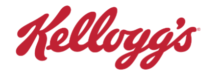

# Spring 2022 Community Partners

The following list includes links to our Spring 2022 community partners and their websites.  Michigan State University and the Department of Computational Mathematics Science and Engineering would like to thank these generous partners for supporting our students. 

All of the sponsor logos presented here and elsewhere in this website are the property of those respective organizations and are used with their permission. 

| | 
|:---|
|  |
|  |
|   | 
|   |
|   | 
|   |
|   | 
|   | 
| **_The QSIDE Institutue_**   | 

