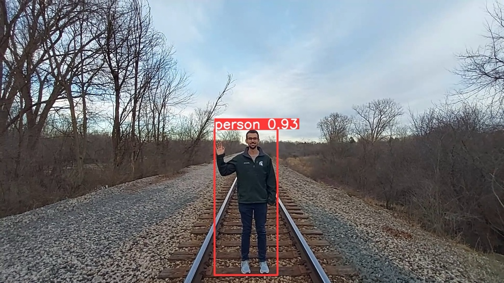

In the Spring 2024 Semester Data Science Capstone course (CMSE 495), our team, comprising Aryan Dhar, Colin Fairbourn, James Fletcher, Joseph Dougherty, and Matthew Roberts, partnered with [Intramotev](https://intramotev.com/), an autonomous train company based in St. Louis, Missouri. 

The previous capstone team successfully configured the You Only Look Once (YOLO), an open-source object detection AI, to identify various objects in images, including cars, buses, and people. Our challenge was to build on this work by refining the model and trying to add distance estimates. This involved the challenging task of studying the previous team's documentation and understanding and building on their work.

Once we had the updated YOLO model working we needed to figure out how to estimate the real word distance from the tracks to assess the danger level of objects detected in the live video feed. We used the fact that the spacing between train rails is constant to build a conversion of pixels to real world measurements.  

We started by building a customized line detection algorithm to detect the rails and use the law of similar triangles to estimate distance from the train at any point along the rail. The distance of objects from the rails is estimated by counting horizontal pixels from the rail to the closest edge of the object’s bounding box and multiplying that by the standardized rail distance divided by the pixels between the rails at that location.  Incorporating these techniques enabled us to estimate distances and assess the potential danger of objects interacting with the train with objects closer to the tracks being more hazardous than those farther away. 

Future work involves better accounting for curvature in the rails and the possibility of integrating more direct measurements such as stereo vision and/or LiDAR. 

As data science students, we expected to learn a lot about data science skills, and we've encountered valuable learning experiences. This project was a significant learning opportunity. Working with vision systems is new to us, and we had to learn to build some of the models from scratch. This experience will provides us with valuable real-world insights, as many data science projects in the business world involve working with pre-existing models and building solutions around them.
